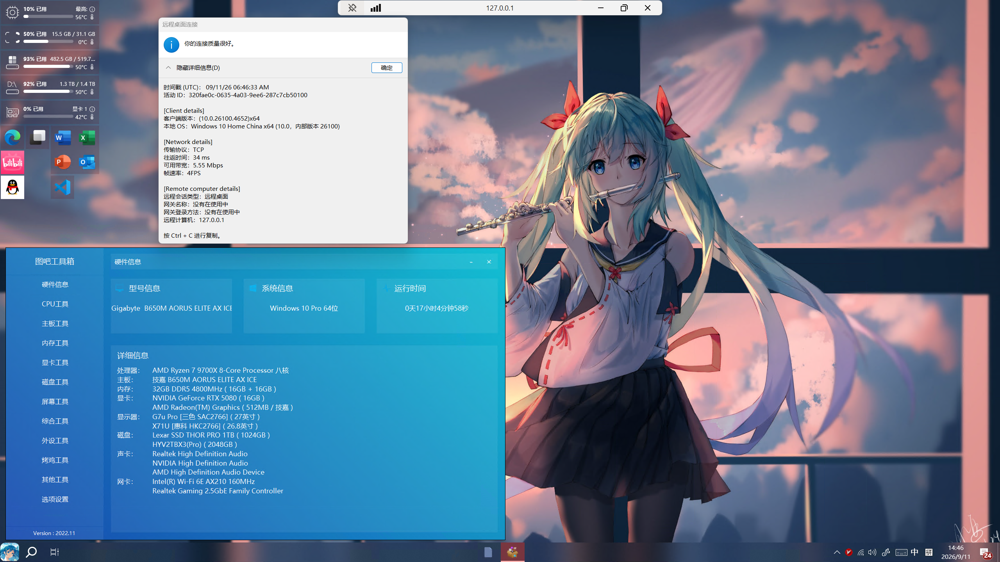

# 远程桌面端口转发

## 背景

基于上一篇 [SSH端口转发](https://mqnu00.github.io/blog/posts/ops/ssh-port-forwarding/ssh-port-forwarding.html)。

有一天想起来家里用来打游戏的电脑A还开着，A和服务器B在同一局域网下，我的笔记本C不在局域网，通过 FRPC 透传了B的 SSH 端口。

想要实现B转发A的3389远程桌面端口。

## 过程

### 探测A的IP

路由器只绑定了B的IP(192.168.10.37)，A没有绑定，所以要找。

最终确定了A是192.168.10.11(DESKTOP-RVFIIOO)

步骤：

1. 并发扫描 192.168.10.0/24 网段，读 **ARP 缓存**，找到9台在活动的设备（经过MAC去重）

   | IP            | MAC               | 备注           |
   | ------------- | ----------------- | -------------- |
   | 192.168.10.1  | d4:b7:09:24:db:71 | 路由器（网关） |
   | 192.168.10.4  | 2c:19:5c:29:6d:6c |                |
   | 192.168.10.7  | b4:0e:de:6f:49:6a |                |
   | 192.168.10.11 | 80:84:89:8f:a1:1f |                |
   | 192.168.10.50 | ea:f5:2a:73:84:94 | 与 .75 同 MAC  |
   | 192.168.10.60 | 16:91:1d:5b:5e:b9 | 与 .67 同 MAC  |
   | 192.168.10.64 | 4c:6b:b8:4f:f7:87 |                |
   | 192.168.10.66 | 90:fb:5d:e3:e5:1a | 与 .77 同 MAC  |
   | 192.168.10.67 | 16:91:1d:5b:5e:b9 |                |
   | 192.168.10.71 | ee:dc:b1:94:8f:45 |                |
   | 192.168.10.75 | ea:f5:2a:73:84:94 |                |
   | 192.168.10.77 | 90:fb:5d:e3:e5:1a |                |

2. 根据**特征**分辨windows主机

   > 特征：
   >
   > - TTL Windows 默认 128，Linux 64，网络设备 255
   >   通过 ping 发送 ICMP包，只有4台响应
   >
   >   | IP            | TTL  |
   >   | ------------- | ---- |
   >   | 192.168.10.1  | 64   |
   >   | 192.168.10.4  | 64   |
   >   | 192.168.10.11 | 128  |
   >   | 192.168.10.77 | 64   |
   >
   > - windows 一般会开放 135/139/445/3389 等端口
   >   通过TCP探测端口是否开放，最后确定只有 192.168.10.11 都符合

3. 通过**NetBIOS over TCP/IP (NetBT) 协议**查询主机名

   ```shell
   $ nmblookup -A 192.168.10.11 2>&1
   Looking up status of 192.168.10.11
   	DESKTOP-RVFIIOO <00> -         M <ACTIVE> 
   	WORKGROUP       <00> - <GROUP> M <ACTIVE> 
   	DESKTOP-RVFIIOO <20> -         M <ACTIVE> 
   
   	MAC Address = 80-84-89-8F-A1-1F
   ```

### 通过 SSH 端口转发

```shell
ssh -N -L 3389:192.168.10.11:3389 -p <frp映射的SSH端口> <用户名>@<frps公网IP>
```

## 最终效果



